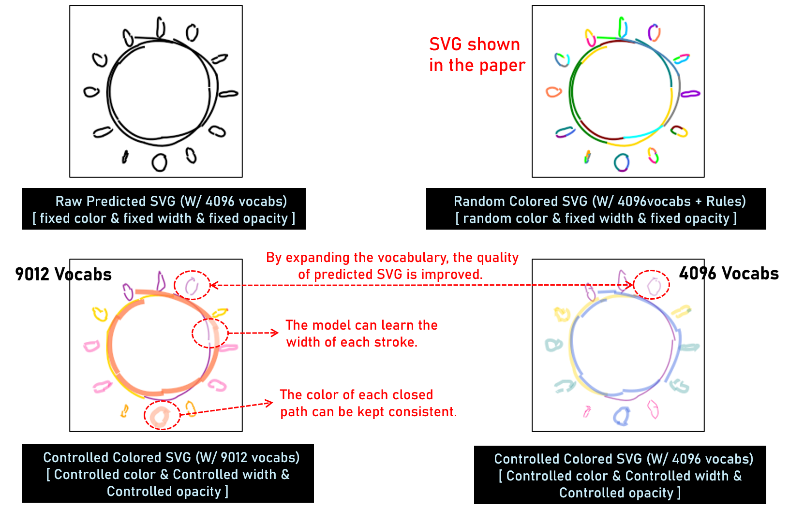
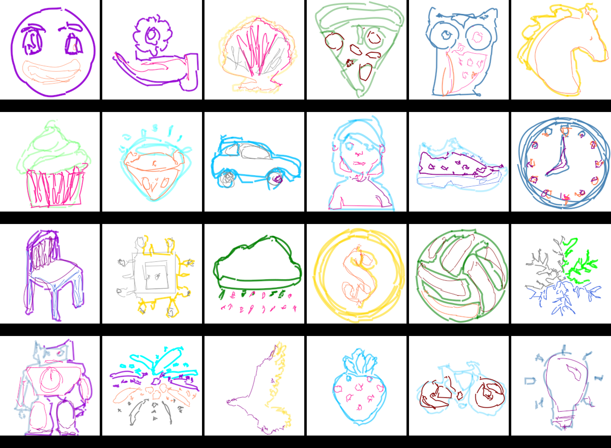
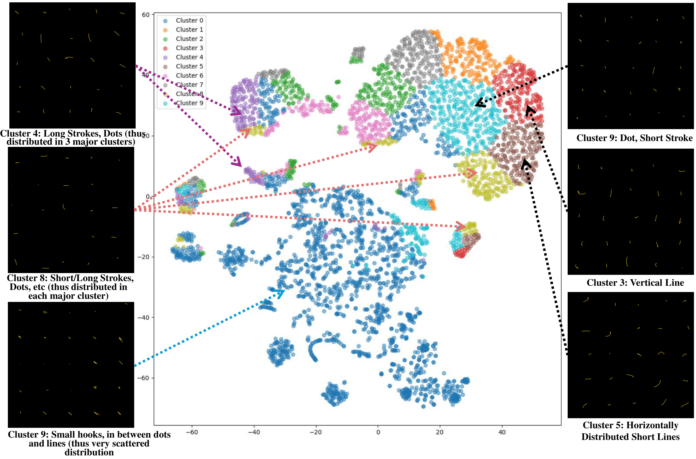
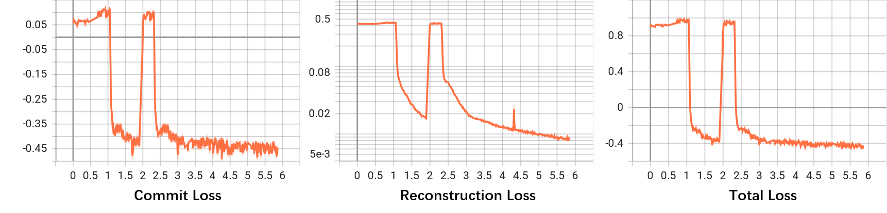
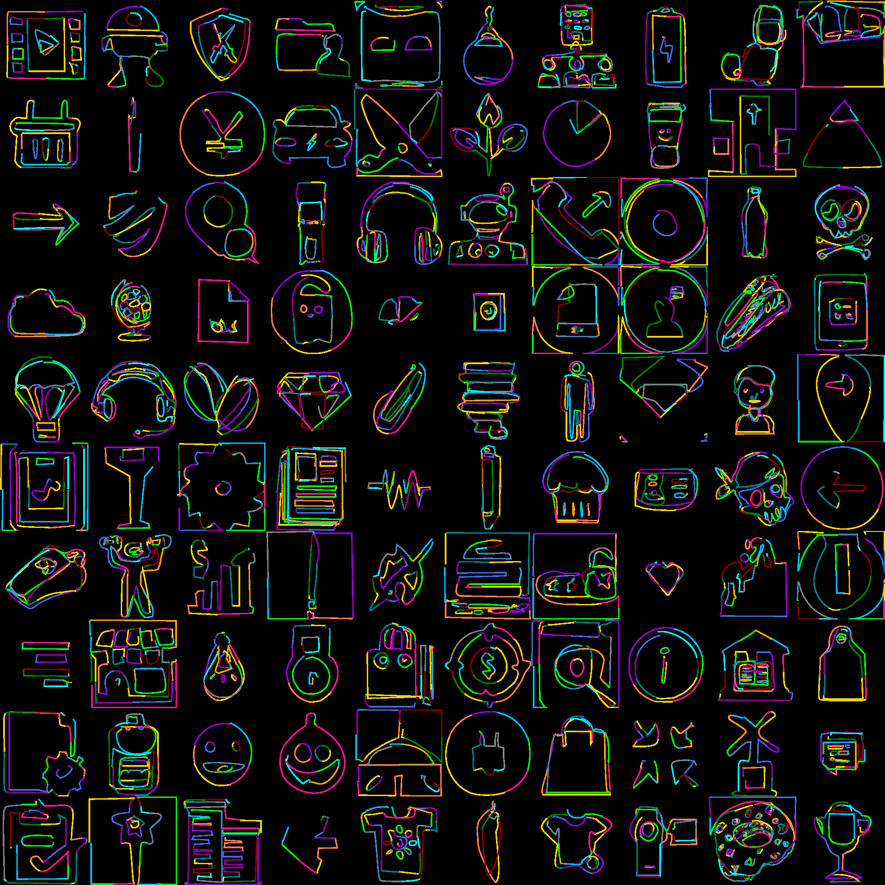
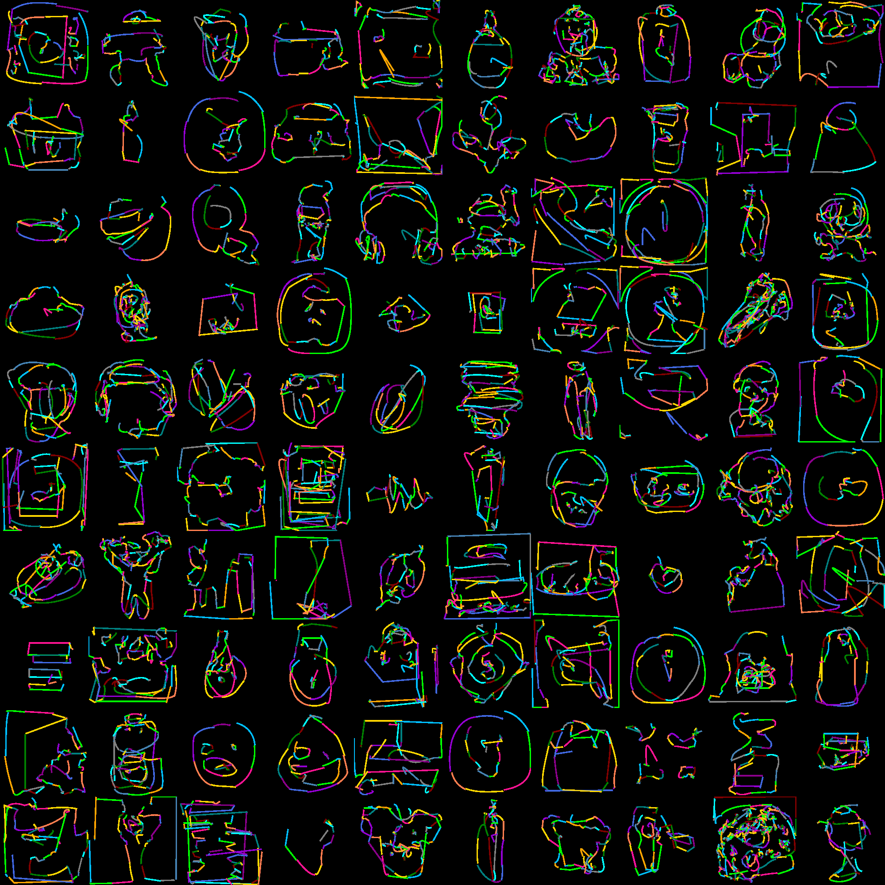
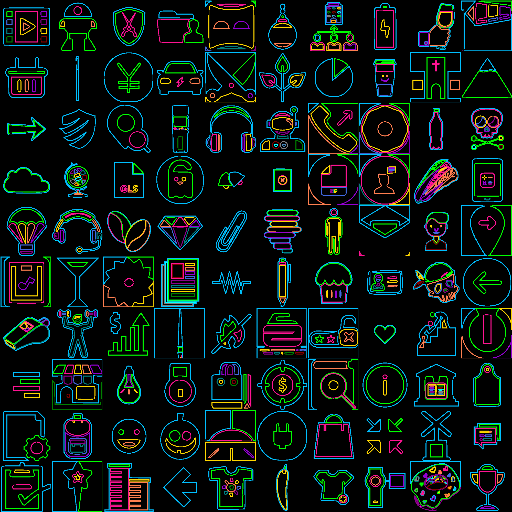
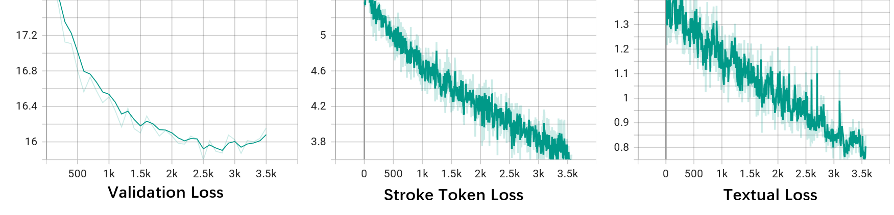
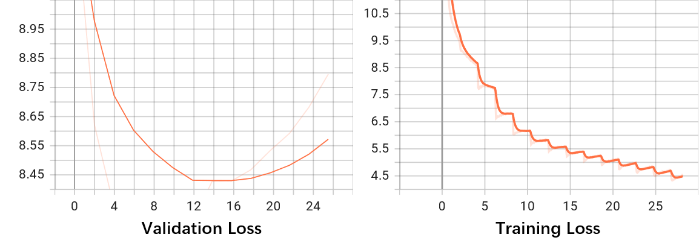

# Supplemental Materials

## SVG Generation with more Attributes

### Illustration of SVG Generation with more attributes (color, stroke width and opacity)

In order to incorporate more elements into the process of Stroke generation, we have expanded the Code to Matrix method (as described in section 3.2.1 of the original paper). Specifically, we have added three placeholders to the original matrix, so that 
`K_{ij} = f(C_{ij}) = (T, x_0, y_0, c^{x}_0, c^{y}_0, c^{x}_1, c^{y}_1, x_1, y_1)_{ij}` (Equation 1 in original paper) becomes `(\mathcal{K}_{i}^{j})^{\prime} = f^{\prime}(\mathcal{C}_{i}^{j}) = (T, color_i, width_i, opacity_i, x_0, y_0, c^{x}_0, c^{y}_0, c^{x}_1, c^{y}_1, x_1, y_1)_{i}^{j}`.

`It's worth noting` that the placeholders here can be expanded to any number, which can be defined by the user and reflected to the SVG through rules. 
For simplicity of demonstration and validate the feasibility of adding more attributes into ''stroke tokens'', we have inserted three special placeholders:
- *$color_i$*: to control the color of the SVG path;
- *$width_i$*: to control the width of the SVG path; 
- *$opacity_i$*: to control the transparency of the SVG path. 

Since the SVG dataset we used does not provide these parameters, we randomly generated some values for a toy experiment.

#### The comparison of effects using different attributes:
The **Raw predicted SVG** only uses numerical coordinates as attributes, while **Random Colored SVG** fills the color attribute in the SVG Path using a rule-based method. 
The two figures below show the results trained with **VQ-Stroke** with different dictionary sizes and additional attributes, e.g., color, path width, and opacity. 

  

#### Attribute Controlled Prediction from EDM model
We retrain the EDM model in the paper using the aforemented ''stroke tokens'' which fused with 3 attributes. 
Finally, the effect of Figure 2 in original paper is shown below:

  

## Prediction of Stroke Order 
We selected a portion of test cases from the development set, allowing StrokeNUWA to predict corresponding SVGs based on keywords. Since we have to compare with the original SVGs with respect to the stroke order, we fine-tuned the model on the development set. Below are the some results generated by the model and the stroke order. In each group, the left side shows the stroke order predicted by the model, while the right side shows the Golden stroke order.

#### *Keywords: Person (Prediction Order: left | Golden Order: right)*
")
")

#### *Keywords: Robot, Gear (Prediction Order: left | Golden Order: right)*
")
")

#### *Keywords: Three Fish, Clownfish (Prediction Order: left | Golden Order: right)*
")
")

#### *Keywords: Cycle, Arrow (Prediction Order: left | Golden Order: right)*
")
")

#### *Keywords: Wave, Beat (Prediction Order: left | Golden Order: right)*
")
")

#### *Keywords: Clover, Vessel (Prediction Order: left | Golden Order: right)*
")
")

We can observe that, since the model is trained based on VQ-Stroke, it **basically follows the stroke order of the original SVGs**. Partically, in each SVG, we can clearly see (especially in the complex SVGs of the keywords "Person", "Robot" and "Fish") that the strokes are continuous and have certain semantic characteristics, such as **first outlining the shape, then filling in details within the outline**.

``Noting`` You can find more gif images demonstrating the stroke order in the `./more_cases` folder.

## Semantic Clusters of Strokes

We adopt the following configuration of VQ-Stroke (**the depth of the residual vector quantization is 2, with compression rates of 2 and 4, respectively, and a vocabulary size of 4096**, which is the model configuration used in the main experiment), and performed clustering on all stroke tokens in the stroke codebook. 

Here we present the results of vocabulary clustering under the condition of a **compression rate of 2**.

  

We manually set the number of clusters to 10 categories and analyze them using the KNN+T-SNE method (https://en.wikipedia.org/wiki/T-distributed_stochastic_neighbor_embedding). 
We have divided the clustering results into two types. 

Specifically, the cases in the right column of the above figure indicate that **the distribution of these stroke tokens is very concentrated**. 
These Stroke Tokens have very distinct features, such as representing **Dots, Vertical Lines, or direction-specific short lines**. 

In contrast, the cases in the left column represent strokes with **less distinct features**. 
This type of strokes includes **various different categories of stroke types** (for example, short/long strokes, direction-specific hooks, etc.). 
We believe that these types of strokes (on the left) **constitute complex SVGs**, and are greatly influenced by the vocabulary size set in VQ-Stroke.
A larger vocabulary may learn more complex and layered strokes.

## Comparison with Other Visual Representation Methods
We also explore LFQ[1] visual encoding method in addition to the VQ-VAE encoding approach. Specifically, the parameters for our VQ-VAE and LFQ are as follows:

| Methods | #Down-Sample Blocks | Conv1d-Stride | Codebook Size | Block / Quantizer Dimension |
| --- | :---: | :---: | :---: | :---: |
| VQ-VAE | 2 | 2 | 4096 | 512 / 512 |
| LFQ (Experiment 1) | 2 | 2 | 8192 | 512 / 13 |
| LFQ (Experiment 2) | 2 | 2 | 16384 | 512 / 14 |

Since the official training code of LFQ is not provided, we conduct the training based on a third-party's reproduced code [https://github.com/lucidrains/vector-quantize-pytorch](https://github.com/lucidrains/vector-quantize-pytorch). In the case of LFQ (Experiment 1). The "commitment loss" not only exhibits oscillations but also converges rapidly. At the same time, the "Total Loss" and "Reconstruction Loss" show a stable trend after training for 3.5K steps. 

Therefore, we adopt the approach of LFQ (Experiment 2). The final reconstruction results are shown below, where we also show the reconstruction results of VQ-Stroke and ground truth SVG.

`Note`: We find that the reconstruction effectiveness of LFQ is not as good as that of the VQ-VAE approach, and LFQ also uses a larger vocabulary, which is disadvantageous when combined with LLM later (a larger vocabulary means it is more difficult to learn). This is also the main reason why we do not adopt LFQ in the end.

### Reconstruction SVGs from VQ-Stroke (based on VQ-VAE)

  

### Reconstruction SVGs from LFQ

  

### Ground Truth SVG

  

## Selection about Different Model Architecture
Here we describe the process of the backbone model selection process.
Despite the many successful multimodal models that currently exist, many of which use visual encoding to transform visual information into discrete tokens[2,3,4], we made the following attempts (Vocab-Separation Decoder-Only Model, Vocab-Merge Decoder-Only Model, and Encoder-Decoder Model) in selecting the backbone LLM.

### Vocab-Separation Decoder-Only Model (Fails to converge on validation set)
If the vocabulary separation approach is employed, it requires utilizing two different sets of embeddings and prediction heads as well as the loss calculation for the text portion (prompt) and stroke token portion. We provide the loss curve below. Despite the continual decline in the training set's loss, the loss on the development set quickly converges and stabilizes at a high value (around 16). Even with adjustments to the weight of the loss for different parts, similar outcomes persist.

  

### Vocab-Merge Decoder-Only Model (Possible)

In order to leverage the prior knowledge from pre-trained LLMs, under the vocab-merge setting, we arrange the index of the new stroke tokens after the textual tokens, and expand the embedding and LM_head in the decoder-only model along the sequence length dimension, followed by full finetuning. The subsequent loss curve is presented below. We can observe that the decoder-only model exhibits lower loss reduction compared to the Vocab-Separation approach (on both the Training and Validation sets). **However, the model can only generate very simple SVGs, and it still fails to predict complex SVGs. We present some examples below.**

  

## Reference
[1] Yu, Lijun, et al. "Language Model Beats Diffusion--Tokenizer is Key to Visual Generation." arXiv preprint arXiv:2310.05737 (2023).

[2] Esser, Patrick, Robin Rombach, and Bjorn Ommer. "Taming transformers for high-resolution image synthesis." Proceedings of the IEEE/CVF conference on computer vision and pattern recognition. 2021.

[3] Yan, Wilson, et al. "Videogpt: Video generation using vq-vae and transformers." arXiv preprint arXiv:2104.10157 (2021).

[4] Ramesh, Aditya, et al. "Zero-shot text-to-image generation." International conference on machine learning. Pmlr, 2021.